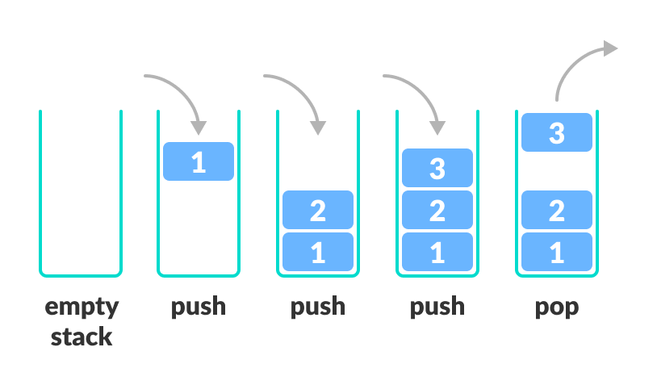

## Lab3 - Last In First Out (LIFO)
## About LIFO
**Lifo** is an abbreviation for last in, first out. 
It is a method for handling data structures where the first element is processed last and the last element is processed first.

To better understand LIFO, imagine stacking a deck of cards by placing one card on top of the other, starting from the bottom. Once the deck has been fully stacked, you begin to remove the cards, starting from the top. This process is an example of the LIFO method, because the last cards to be placed on the deck are the first ones to be removed.

## Graph

